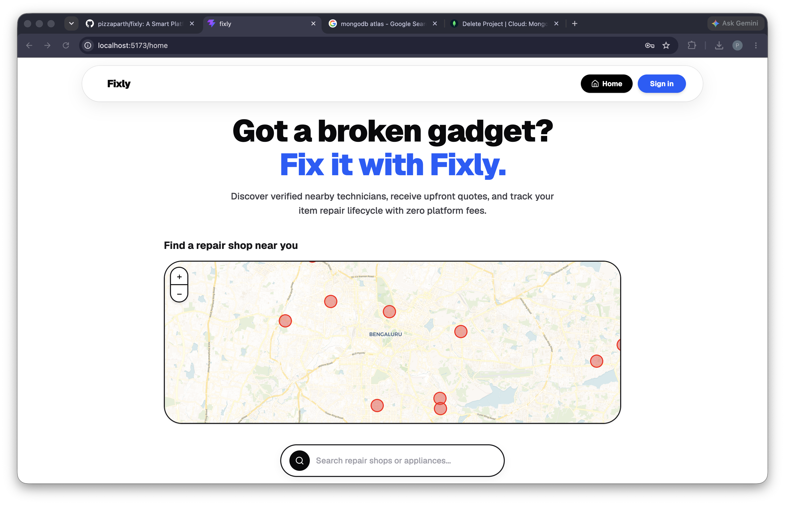
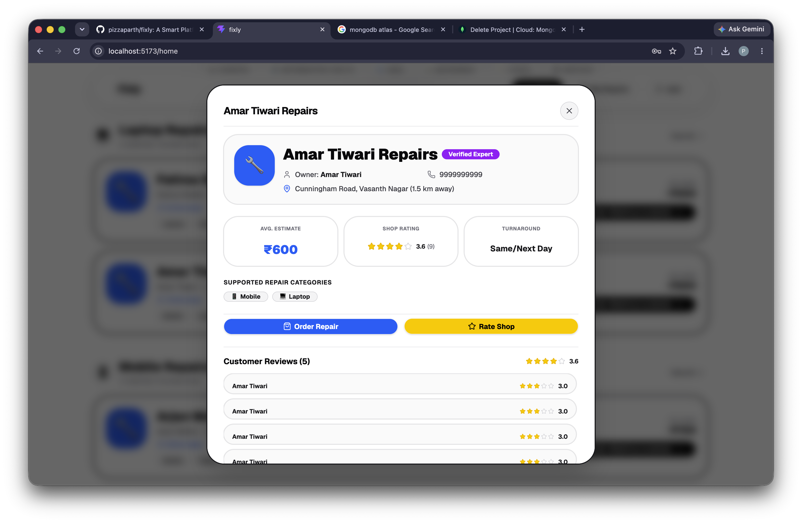
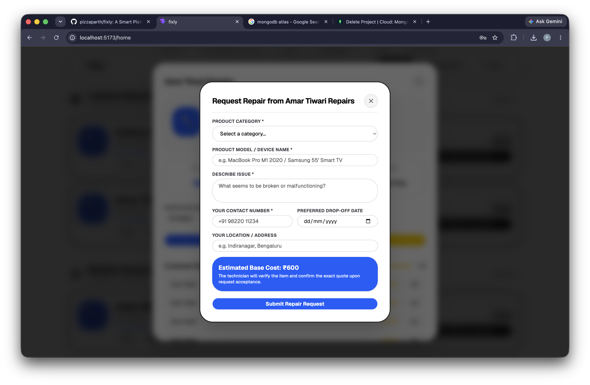
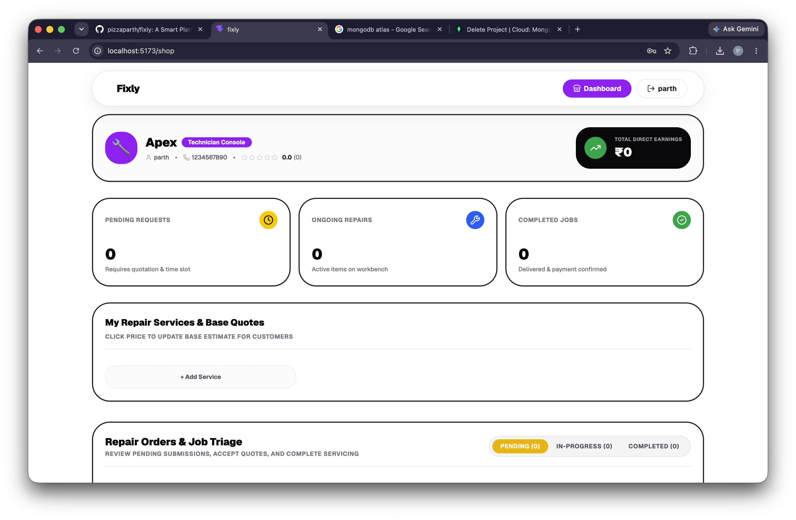
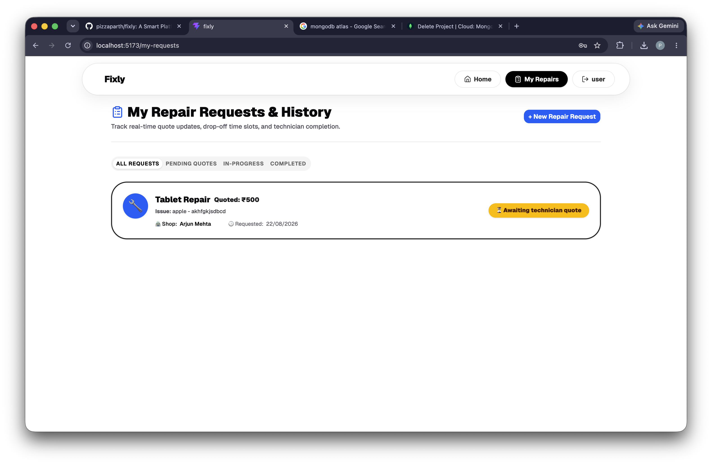
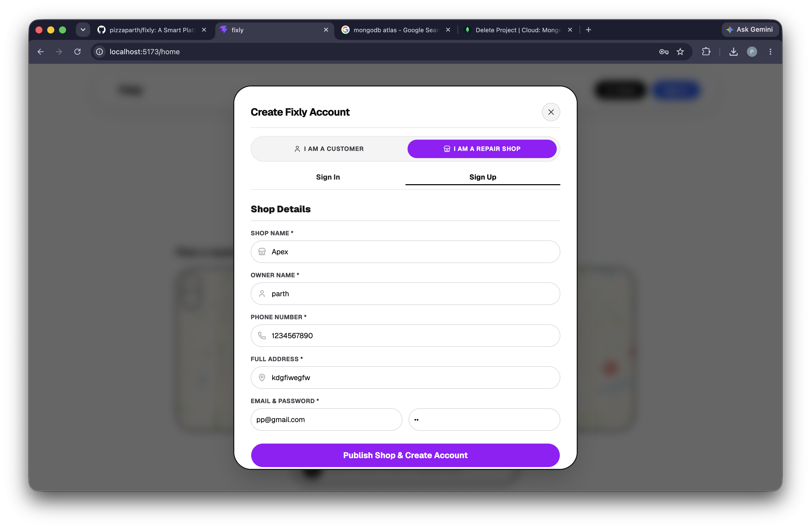

# Fixly - SwiftShft Hackathon

| Name | Registration Number |
| :--- | :--- |
| Parth Pancholi | 25BCE10443 |
| Abhinav Kumar | 25BAI10858 |

## About The Project
Fixly is a hyper-local electronics repair marketplace designed to bridge the gap between consumers facing device issues and trusted neighborhood repair technicians. By providing a transparent, map-based discovery interface, Fixly eliminates the friction of finding reliable electronics repair services.

## Problem Statement
When electronic devices break, consumers often struggle to find trustworthy, local repair shops with transparent pricing. Traditional search engines lack specific repair pricing estimates and real-time job tracking, leading to a frustrating customer experience and lost business for skilled local technicians.

## The Solution
Fixly solves this by offering a dual-sided platform:
1. For Consumers: A seamless web application to discover nearby repair shops on an interactive map, view estimated repair costs based on device categories, book repair requests instantly, and track the live status of their repair jobs.
2. For Technicians: A comprehensive dashboard to list their services, manage incoming repair requests, provide exact quotes, update job statuses, and build their reputation through verified customer ratings.

## Platform Previews

### 1. Interactive Map Discovery

*The main landing page featuring an interactive map for discovering local repair experts.*

### 2. Shop Details & Profile

*Detailed profile view of a local repair shop, showing contact details, location, and verified status.*

### 3. Repair Booking & Transparent Quoting

*Consumers can select their product category and get an upfront estimated base cost before submitting a repair request.*

### 4. Technician Triage Dashboard

*A comprehensive Kanban-style dashboard for technicians to manage incoming requests, issue quotes, and track earnings.*

### 5. Customer Tracking Portal

*Consumers can track the live status of their repairs, view quotes, and drop-off deadlines.*

### 6. Seamless Authentication

*A unified, animated authentication modal for both consumers and repair technicians.*

## Core Features
- Interactive Map Discovery: Discover repair shops geographically using a high-definition Leaflet map integration.
- Transparent Quoting System: Consumers see an estimated base cost upfront. Technicians review the issue and provide an exact, binding quote.
- Real-Time Order Triage: Technicians manage a pipeline of Pending, In-Progress, and Completed jobs.
- Customer Tracking Portal: Consumers track their device's repair lifecycle and drop-off/pickup schedules.
- Verified Rating System: Post-repair rating system to maintain quality and trust within the marketplace.
- Custom UI/UX: Built with a modern, solid-color design system featuring physics-based animations and strictly rectangular geometry.

## Tech Stack
- Frontend: React 19, Vite, Tailwind CSS v4, framer-motion, react-router-dom, react-leaflet
- Backend: Node.js, Express.js
- Database: MongoDB, Mongoose
- UI Components: shadcn/ui and custom primitives

## Getting Started

### Prerequisites
- Node.js (v18 or higher)
- MongoDB running locally on port 27017

### Installation
1. Clone the repository and navigate to the project root.
2. Install dependencies:
   npm install
3. Start the backend and frontend concurrently:
   npm run dev
4. Open the application in your browser at the provided localhost URL.
